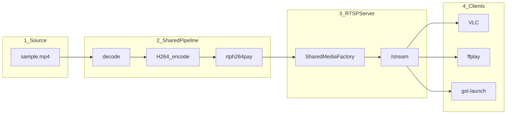
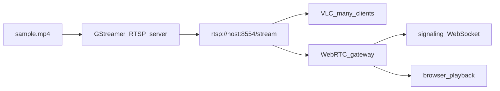
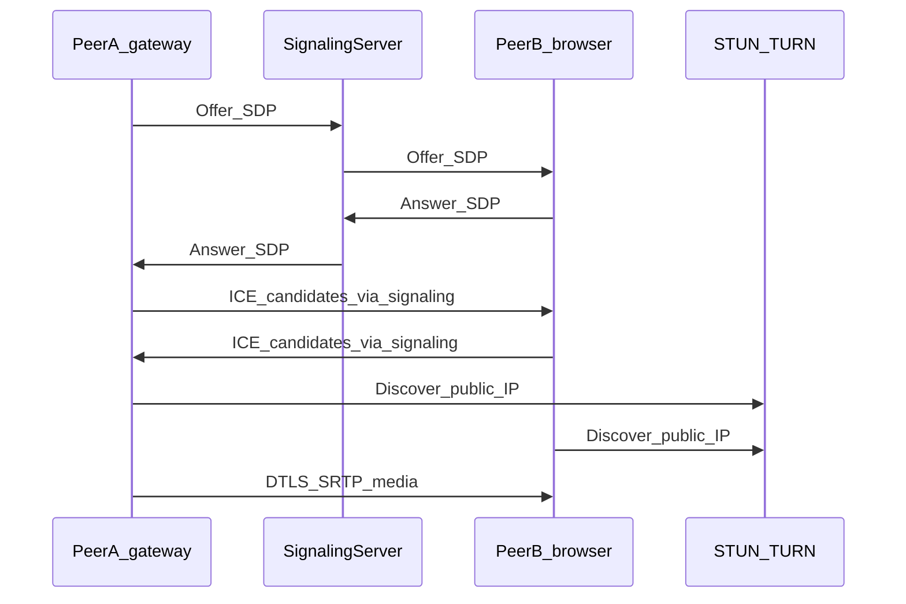
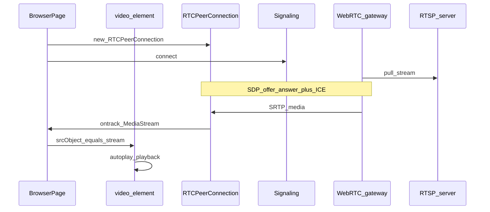

# Streaming architecture — GStreamer RTSP + WebRTC

Demo streaming pipeline for XandY. Source is a sample MP4. Goal: scale efficiently for a demoable number of clients, with optional browser playback.

---

## Goals

- Stream video over the network with GStreamer
- Start from a sample MP4 file
- Serve multiple demo clients from **one shared encode** (not one encode per viewer)
- Support tool clients (VLC / ffplay) and, later, **browser playback**
- Walk the architecture piece by piece

Demo target: tens of concurrent viewers on one machine — enough for a live demo, not thousands.

---

## Protocol choice

| Need | RTSP | WebRTC |
|------|------|--------|
| Easy demo | VLC / ffplay / `gst-launch` — one URL | Needs signaling + STUN; strong for browser |
| Scale for demo clients | **One encode, many viewers** via shared media | Usually one peer path per client (or an SFU) |
| Sample MP4 source | Trivial (`filesrc` / `uridecodebin`) | Same, but more plumbing around it |
| Browser playback | Not native | Built into Chrome / Firefox |

**Phase 1 choice: RTSP with `gst-rtsp-server`.**  
One shared encode pipeline; N clients pull the same stream.

**Phase 2: WebRTC gateway for browser playback** (Approach B below).  
WebRTC is not “browsers only” as a protocol — native apps and GStreamer can speak it too — but its main product win here is **effortless playback in a webpage**.

---

## Phase 1 — RTSP core (shared pipeline)



### Piece 1 — Source

- Input: `samples/sample.mp4` (or path via env/CLI)
- Path: `filesrc` → `qtdemux` / `decodebin` → raw video (audio optional later)
- Goal: prove the file plays locally before networking

### Piece 2 — Shared encode pipeline

- Decode once → `videoconvert` / `videoscale` (e.g. 1280x720) → H.264 (`x264enc` or hardware) → `h264parse` → `rtph264pay` (`pt=96`, `config-interval=1`)
- Do **not** spawn a full decode+encode per client
- Use `GstRTSPMediaFactory` with shared media (`set_shared(True)`) so late joiners attach to the same pipeline

### Piece 3 — RTSP server

- `GstRTSPServer` on port `8554` (configurable)
- Mount: `rtsp://<host>:8554/stream`
- C++ process (`build/rtsp_server`) using GStreamer C API + `gst-rtsp-server`
- Shared factory: `gst_rtsp_media_factory_set_shared(factory, TRUE)`
- CLI: `--file`, `--port`, `--mount`

### Piece 4 — Clients (demo verification)

- `ffplay -rtsp_transport tcp rtsp://127.0.0.1:8554/stream`
- VLC with the same URL
- Optional: second machine on LAN
- Smoke: 3–5 clients, confirm one encode / stable CPU

### Piece 5 — Ops / packaging

- README: GStreamer + `libgstrtspserver` system packages, `make`, run command
- Optional Docker later
- Logging: listen URL, pipeline graph summary, pipeline errors

---

## Scaling model (demoable clients)

- **Shared factory** = one decode + one encode for all RTSP viewers
- Fixed resolution/bitrate (e.g. 720p @ 2–4 Mbps) keeps CPU predictable
- RTSP session overhead is light vs re-encoding; demo bottleneck is usually encode cost
- Out of scope for v1: auth, recording, ABR, Kubernetes autoscaling

---

## Phase 2 — RTSP + WebRTC (browser playback)

**Approach B (recommended): RTSP as main stream + WebRTC gateway.**



### How it works

1. Core service remains RTSP (shared factory, scales for tool clients)
2. A **gateway** (GStreamer `webrtcbin`, or MediaMTX / Janus / similar):
   - **pulls** the RTSP URL as a client
   - **publishes** that media into WebRTC for browsers
3. Browser never speaks RTSP; it only does WebRTC with the gateway

### Why this approach

| Piece | Role |
|-------|------|
| GStreamer RTSP server | Source of truth; shared encode for many RTSP clients |
| WebRTC gateway | Browser adapter (RTSP in → WebRTC out) |
| Signaling (WebSocket/HTTP) | SDP offer/answer + ICE only — not the video path |
| Browser page | `RTCPeerConnection` → `<video>` |
| STUN / TURN | NAT traversal when not on the same LAN |

**Pros:** Clear split; ship RTSP first; add browser later without redesigning the core.  
**Cons:** Extra hop (small latency); gateway must be up for browser viewers.

### Alternative (not first): tee dual-egress

One encode, `tee` to RTSP server and to `webrtcbin` per browser. True single encode, but you own signaling/ICE in the same process earlier.

### Many browser viewers later

Naive WebRTC fan-out grows with peer count. For many browser clients, add an **SFU** after the gateway (or replace per-peer send with an SFU), still often fed from the same RTSP URL.

---

## How WebRTC works (overview)

WebRTC is a stack for real-time media between peers. Three parts:

1. **Signaling** (not one standard protocol) — exchange SDP offer/answer and ICE candidates (e.g. over WebSocket)
2. **ICE + STUN/TURN** — find a working network path (LAN, NAT, or relay)
3. **DTLS / SRTP** — encrypted media (RTP-like) on the chosen path

Signaling sets up the session; media usually does **not** go through the signaling server.



---

## Browser playback (Approach B)

The browser does not open the RTSP URL. Playback is:

**WebRTC remote track → `video.srcObject`**



### Browser-side steps

1. Create `RTCPeerConnection` (with STUN/TURN `iceServers`)
2. Exchange SDP + ICE via signaling with the gateway
3. On `pc.ontrack`, set `video.srcObject = event.streams[0]`
4. Play with `<video autoplay playsinline>`

| Normal web video | WebRTC playback |
|------------------|-----------------|
| `video.src = "file.mp4"` or HLS URL | `video.srcObject = MediaStream` |
| HTTP download / segments | Live SRTP via WebRTC |
| Seeking often works | Live-ish; seeking usually does not |

### Pixel path

```
sample.mp4
  → GStreamer RTSP server
  → gateway pulls RTSP
  → gateway sends WebRTC (SRTP)
  → browser RTCPeerConnection
  → MediaStreamTrack
  → <video> paints frames
```

### Common failure points

- Signaling OK, no video → ICE/NAT (need STUN/TURN) or codec mismatch
- Black video → autoplay policy or wrong `srcObject`
- Works on LAN, fails remotely → TURN missing

---

## Repo layout (Phase 1 implemented)

```
Streaming_service-x_and_y/
  README.md
  Makefile                      # GNU Make + pkg-config
  docs/
    streaming-architecture.md   # this document
  include/
    config.hpp
    pipeline.hpp
    server.hpp
  src/
    main.cpp
    config.cpp
    pipeline.cpp                # C API bin build + custom media factory
    server.cpp                  # GstRTSPServer + shared factory
  samples/
    README.md                   # drop sample.mp4 here
  build/                        # rtsp_server binary (gitignored)
```

Stack: **C++17 + Makefile + GStreamer** (`gstreamer-1.0`, `gstreamer-rtsp-server-1.0`).

Phase 1 status: RTSP shared-pipeline server is in-tree. WebRTC gateway is not implemented yet.

---

## Walkthrough order

1. Local MP4 → decode → display / fakesink (no network)
2. Add H.264 + RTP payloader
3. Wrap in `GstRTSPServer` + shared factory; single client — **current**
4. Multi-client RTSP demo; tune bitrate/resolution
5. Later: WebRTC gateway + HTML player for browser playback
6. Later if needed: SFU for many browser viewers

---

## Decision summary

| Decision | Choice |
|----------|--------|
| v1 protocol | RTSP + shared media factory |
| Source | Sample MP4 |
| Browser playback | Phase 2 via RTSP → WebRTC gateway |
| Control plane | C++17 + Makefile (pkg-config) |
| Scale model | One encode, many RTSP clients; WebRTC for browser adapters |
